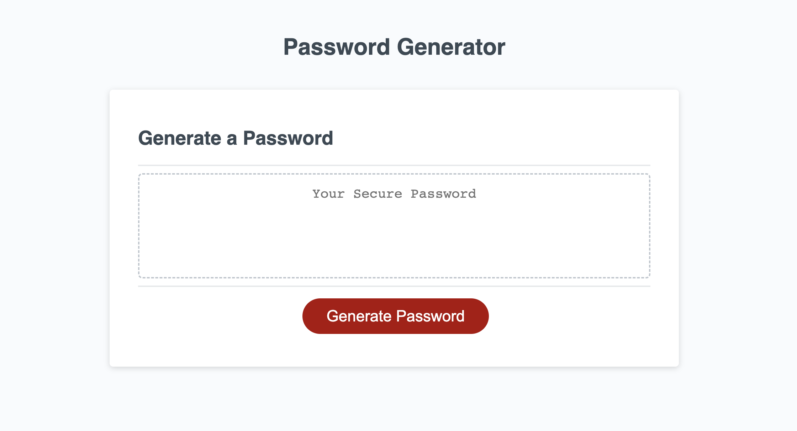
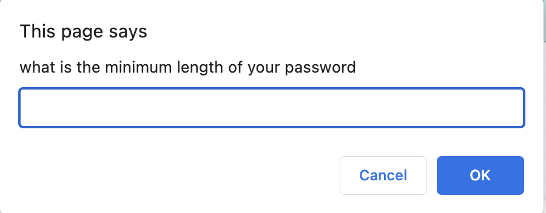
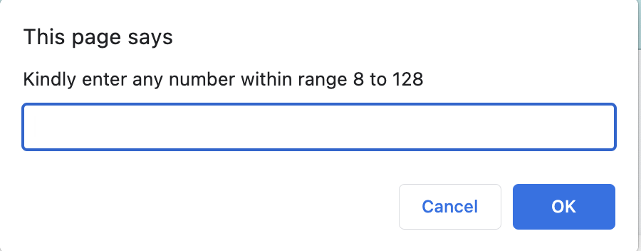

# Password-Generator
Its a prompt based password generator project. </b>
For second trial kindly refresh the page and click the generate button.</b>

 The application enables employees to generate random passwords based on criteria that they’ve selected. This app will run in the browser and will feature dynamically updated HTML and CSS powered by JavaScript code that you write. It will have a clean and polished, responsive user interface that adapts to multiple screen sizes.

 </b>

 </b>

 </b>

